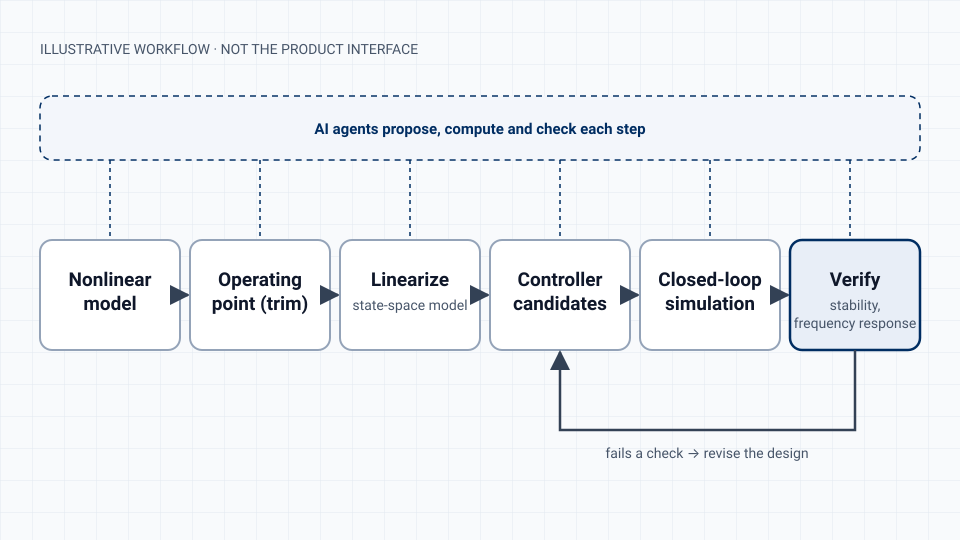

I took an AI-assisted control-design platform from concept to an MVP. It has completed two proof-of-concept cycles and passed the company's internal product-readiness gate.

The product has not launched commercially. A formal B2B product-market-fit programme comes next, so this page makes no claims about paying customers, revenue or product-market fit. The company is an early-stage agentic-AI startup, and its name, customers and internal targets are confidential.

<dl class="snapshot">
  
<dt>My role</dt><dd>Technical Product Manager (Mar 2026 to present). Before that, Robotics Software Engineer on the same product (Nov 2025 to Mar 2026).</dd>

  
<dt>Team</dt><dd>Seven engineers and three stakeholders across AI, control engineering, software, product design and QA</dd>

  
<dt>Stage</dt><dd>MVP, two POC cycles complete, readiness gate approved</dd>

  
<dt>Ways of working</dt><dd>Agile/Scrum with Jira, Mizito, Notion and Google Workspace</dd>

</dl>

<figure>

<figcaption>The kind of workflow the platform automates. This diagram is illustrative and does not show the product interface.</figcaption>
</figure>

## The problem

Designing a controller takes a chain of specialist steps. An engineer starts from a nonlinear model of the system, finds an operating point and linearizes it into a state-space model. Then they design and tune candidate controllers, run closed-loop simulations, and check stability and frequency response. Each step needs expertise and usually a different tool, and when a check fails, much of the chain has to be repeated.

The product's bet is that AI agents can carry much of that chain, from a system description to a verified controller candidate.

## My role

I joined the engineering team in November 2025 and was promoted to Technical Product Manager in March 2026.

As an engineer, I built parts of the automated pipeline. That included an agent workflow that generates operating points, state-space models, controller candidates and closed-loop simulations from nonlinear system descriptions. I also worked on model parsing, signal interconnection, Jacobian linearization, and the stability and frequency-domain checks.

As product manager, I own the product definition and its delivery. I wrote the market requirements document, business plan and business model canvas. I also run discovery, write requirements and acceptance criteria, manage the backlog, coordinate the team, validate releases, and wrote the go-to-market strategy and plan.

Having built the pipeline myself made it much easier to write requirements the engineers could act on, and to judge whether a result was correct.

## Discovery

I ran market research, competitive analysis and more than 100 customer interviews. The interviews tested our assumptions about the problem and set our priorities. I turned the findings into product requirements and a prioritized roadmap.

## Main product decisions {#key-product-decisions}

### Scope the MVP around design, simulation and verification

The first release put the capabilities an engineer needs to trust a result first: automated design, closed-loop simulation and verification. Verification was in the core product from the start.

### Use acceptance criteria as the shared definition of done

Every capability had user stories and acceptance criteria written in control-engineering terms. Completed features were checked against them before release, so engineering, design and QA all worked to the same definition of "done".

### Validate before selling

After the MVP, the product went through two proof-of-concept cycles and then an internal readiness gate. Go-to-market execution starts only after that gate.

### Keep technical validation apart from market evidence

Test users can show that the product works. Only companies can show that they need it. The go-to-market plan I wrote defines the company-level evidence the next phase has to collect, so proof-of-concept usage is not counted as traction.

## Delivery

I ran delivery in Agile/Scrum and kept the backlog prioritized in Jira, with Mizito, Notion and Google Workspace alongside it. I coordinated seven engineers and three stakeholders across AI, control engineering, software, product design and QA, and validated each completed feature against its acceptance criteria before release.

## Evidence and results {#results}

In the first proof of concept, 38 academic test users created 198 projects on the platform. The second proof of concept is complete, and the product-readiness gate was approved internally, which clears the product for the next phase.

This is technical product validation with test users. It does not show paid usage, a company pilot or product-market fit.

## What's next

I wrote the go-to-market strategy and plan for the next phase. It covers target accounts, qualification, a launch sequence with gates, and the company-level evidence needed to judge product-market fit. The plan names me as the owner of PMF and go-to-market operations. The formal three-month B2B programme is the next step, and I will add its results here once there are results to report.

The company name, customer names, pricing, roadmap details and any internal metrics beyond those above are confidential. The diagram is illustrative. I'm happy to discuss the work in more depth in an interview, within those limits.

