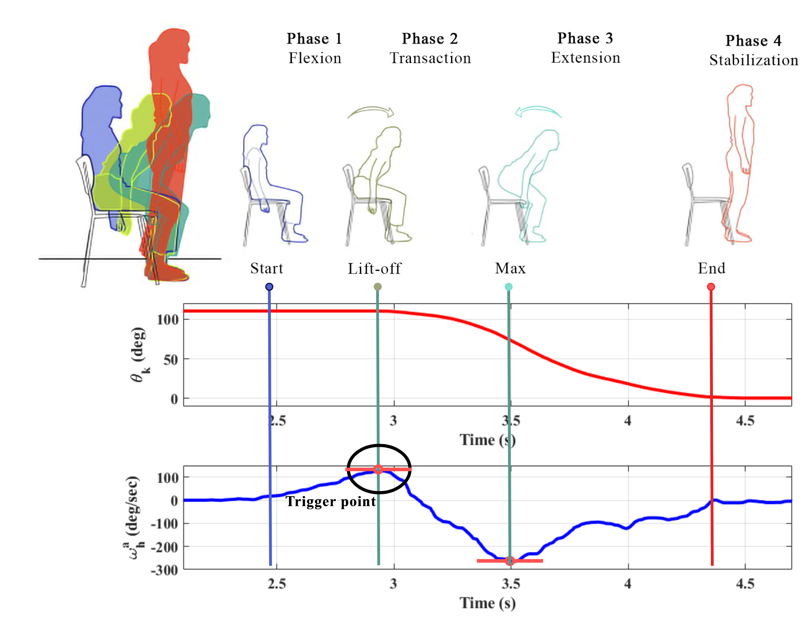
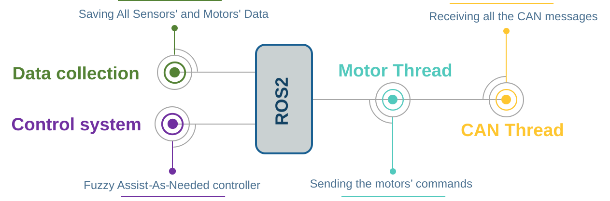
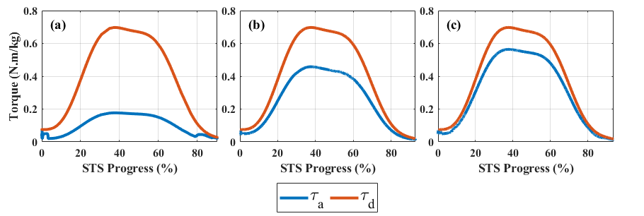
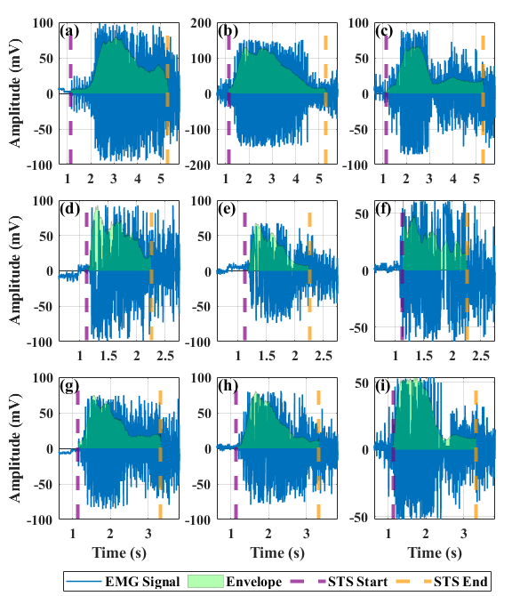

## Executive summary

I served as project manager and first author for the FUM-NEXA sit-to-stand control project at FUM-CARE. The engineering problem was specific: provide enough torque for a user to complete a sit-to-stand (STS) transition without replacing the user's contribution or requiring a high-power, sensor-heavy system. I led the development of a fuzzy Assist-As-Needed (AAN) controller that estimates a real-time Strength Index from hip and knee velocity errors plus torque feedback, then scales the desired knee torque accordingly. The controller was deployed on a custom exoskeleton through a Raspberry Pi 4B, ROS2, and CAN motor interfaces. In the reported engineering evaluation, four healthy subjects performed STS transfers at three speeds. With the 50% assistance setting, average EMG IRMS reduction relative to the no-exoskeleton baseline was 30.34% at slow speed, 13.20% at normal speed, and 7.59% at fast speed. These results support prototype feasibility and a clear speed-dependent trade-off; they do not constitute clinical validation.

## Project snapshot

| Dimension | Evidence-based summary |
| --- | --- |
| Product | FUM-NEXA lower-limb exoskeleton with one passive hip joint and one actuated knee joint per leg |
| User task | Sit-to-stand transition from a 46 cm chair |
| Control concept | Fuzzy Strength Index driving Assist-As-Needed torque |
| Runtime platform | Raspberry Pi 4B, ROS2, Python/C++, and CAN |
| Evaluation | Four healthy subjects, three movement speeds, and three device conditions |
| Research status | Manuscript prepared for consideration by *Robotics and Autonomous Systems* in August 2025; acceptance or publication was not present in the supplied evidence |

## Problem and challenge

Fixed torque profiles are simple to deploy, but they cannot distinguish a user who is moving faster than the reference from one who needs substantial assistance. A rehabilitation device also has to avoid the opposite failure mode: applying so much torque that the user becomes passive. The project therefore had to satisfy several constraints at the same time:

- estimate assistance need from signals available on the robot rather than relying on continuous EMG control;
- adapt torque during the movement, not only between sessions;
- run on a Raspberry Pi-class computer with a small sensor and actuator stack;
- trigger assistance at the correct point in the STS sequence, close to chair lift-off;
- measure whether the device actually reduces human effort after accounting for the mass and inertia of the unpowered exoskeleton.

The last constraint mattered in the experiments. Wearing FUM-NEXA without torque increased measured muscle effort relative to the no-exoskeleton baseline. The product value therefore depends on the controller offsetting the mechanical burden of the device, not merely on the controller producing a plausible torque curve.

## My role and responsibilities

The supplied accomplishment record identifies me as project manager and main author, and the manuscript lists me as first author. The available code and project documents indicate hands-on responsibility across the following workstreams:

- **Control ownership:** defined and implemented the fuzzy Strength Index concept, membership functions, nine-rule inference base, and torque-scaling policy.
- **Robotic software integration:** connected the controller to ROS2 data and motor paths, CAN-based sensors and actuators, real-time filtering, and data logging.
- **System coordination:** coordinated the control, mechanical, experiment, and manuscript work needed to move the idea from a research concept to a working FUM-NEXA prototype.
- **Validation planning:** helped structure the no-exoskeleton, exoskeleton-without-torque, and exoskeleton-with-AAN conditions across slow, normal, and fast STS profiles.
- **Technical communication:** first-authored the manuscript, figures, results narrative, and submission package.

This was a team research project at FUM-CARE. The materials do not support claiming that I was the sole designer, fabricator, or experimenter.

## Key technologies and stack

- **Robot:** custom FUM-NEXA knee exoskeleton; two T-Motor BLDC knee actuators rated up to 48 Nm in the manuscript; magnetic joint encoders.
- **Compute and middleware:** Raspberry Pi 4B and ROS2.
- **Software:** Python, C++, NumPy, SciPy, and scikit-fuzzy.
- **Communication:** CAN for sensor acquisition and motor commands; SocketCAN in the inspected C++ motor and CAN-reader nodes.
- **Control layers:** high-level fuzzy AAN controller and a lower-level PID torque controller on the motor driver.
- **Evaluation:** EMG recordings from Vastus Lateralis, Semimembranosus, and Hamstrings; IRMS, standard deviation, and a relative performance index.

## Solution and implementation

### 1. Convert movement quality into a Strength Index

The controller represents the user's instantaneous ability with a scalar `I_s` in the range 0 to 1. The assistance policy is:

```text
assistive torque = desired torque * (1 - I_s)
```

When the measured motion and torque behavior indicate that the user is keeping up with the reference, `I_s` increases and assistance falls. When the user lags the reference or the robot is not delivering the expected torque, `I_s` decreases and the controller provides more help.

The fuzzy system uses three inputs:

1. knee angular-velocity error;
2. hip angular-velocity error; and
3. the difference between desired and assistive torque.

Each input is mapped to Negative, Zero, or Positive fuzzy sets. The output uses five assistance/strength bands. A nine-rule Mamdani inference system combines the inputs; rule firing uses the minimum membership value and the final crisp index uses centroid defuzzification. This gives the controller a compact rule base instead of a large learned model or a continuous EMG classifier.

### 2. Track a normal STS trajectory without hard-coding one user's motion

The desired hip and knee velocity profiles are sixth-degree polynomials fitted to 20 normal STS transfer shapes from able-bodied data. A normalized knee torque-angle profile supplies the full-assistance reference. The fuzzy index scales that reference rather than replacing it, so the controller retains a consistent movement target while changing the amount of help.

### 3. Trigger assistance from the STS phase

The manuscript divides STS into flexion, transition, extension, and stabilization phases. Assistance starts near lift-off from the chair. The reported trigger criterion uses the combination of stable knee motion and the hip velocity/acceleration pattern observed immediately before lift-off; analysis of 20 STS transfers was used to identify this event.



*The four STS phases and the reported trigger point near chair lift-off.*

### 4. Run the loop on the robot

The runtime architecture separates four functional responsibilities:

```text
CAN sensor data
      |
      v
filter joint velocity and torque signals
      |
      v
compute motion/torque errors
      |
      v
fuzzy Strength Index -> scale desired torque
      |
      v
motor-driver PID -> CAN -> knee BLDC actuators
      |
      v
log sensor, motor, and controller data
```

The implementation source contains a Python fuzzy controller and C++ ROS2 nodes for CAN reading and motor commands. Its real-time filters are second-order Butterworth filters configured with a 400 Hz sampling assumption: 5 Hz for hip velocity and 10 Hz for knee velocity and torque feedback. That configuration is an implementation detail, not a claim that every end-to-end path was measured at 400 Hz.



*Functional ROS2 architecture used for sensor acquisition, fuzzy control, motor commands, and logging.*

## Experimental design

The reported evaluation used four healthy subjects, a 46 cm chair, and three target speeds:

- slow: 20 deg/s;
- normal: 35 deg/s;
- fast: 60 deg/s.

Each subject completed three conditions:

1. **No Exo:** baseline STS without the device.
2. **Exo Without Torque:** the device was worn but delivered no assistive torque.
3. **Exo With Torque:** the AAN controller was enabled with the 50% assistance setting.

The primary analysis used EMG IRMS as a measure of aggregate muscle effort and signal standard deviation as a variability measure. The manuscript defines the performance index as the percentage change from the No Exo baseline; positive values mean lower measured effort and negative values mean higher effort.

## Results and impact

The following values are the manuscript's averages across the four subjects. They are percentage changes relative to No Exo, not clinical effect sizes.

| Condition | Speed | IRMS change | SD change |
| --- | --- | ---: | ---: |
| Exo With Torque | Slow | 30.34% reduction | 33.81% reduction |
| Exo With Torque | Normal | 13.20% reduction | 16.45% reduction |
| Exo With Torque | Fast | 7.59% reduction | 14.10% reduction |
| Exo Without Torque | Slow | 41.21% increase | 30.09% increase |
| Exo Without Torque | Normal | 38.70% increase | 36.17% increase |
| Exo Without Torque | Fast | 40.87% increase | 42.53% increase |



*The AAN torque follows the desired profile shape at a lower magnitude across slow, fast, and normal STS speeds.*

The main product and engineering conclusions are:

- the assistance setting reduced measured effort at all three tested speeds;
- the largest average reduction occurred at slow speed, where assistance is most relevant to users who cannot generate the reference motion easily;
- the benefit weakened at fast speed, so "adaptive" does not mean equally effective in every movement regime;
- the passive mechanical load was large enough to increase effort when torque was disabled, making the no-torque control condition essential;
- the torque trace behaved as intended qualitatively, but the supplied manuscript does not report latency, confidence intervals, statistical significance, actuator safety margins, or long-term reliability.



*Processed Vastus Lateralis EMG examples for the nine speed/condition combinations reported in the manuscript.*

> **Scope limitation:** the experiment involved four healthy subjects. The paper uses labels such as "low-strength" and "moderate-strength" for controller output categories, but the tested group was not a clinical cohort of elderly, post-stroke, or mobility-impaired participants. The results should therefore be presented as an engineering prototype evaluation, not as proof of rehabilitation efficacy.

## Key learnings and takeaways

1. **Assistance is a control policy, not a constant torque value.** Estimating the user's current tracking ability makes the same hardware useful across different movement capabilities.
2. **The mechanical baseline matters.** A wearable robot can increase effort before its controller helps; product evaluation must isolate the device burden from the controller benefit.
3. **Trigger timing is a product requirement.** A correct torque magnitude delivered at the wrong STS phase is still a poor user experience and can destabilize the movement.
4. **Low-power deployment changes the design.** A compact fuzzy rule base, filtered kinematic signals, and a Raspberry Pi/ROS2 stack are practical when compute, sensing, and wiring are constrained.
5. **The next validation step is not another plot from the same cohort.** The project needs larger and more diverse participants, comfort and safety measures, latency and repeatability data, and longer-term evaluation before making rehabilitation or clinical claims.

## Visuals to add next

The supplied manuscript provides the architecture, trigger, torque, and EMG figures embedded above. A stronger public case study would add:

- a short, consented video showing the three experimental conditions;
- a system-level timing diagram with sensor-to-actuator latency and fault handling;
- an anonymized aggregate results plot with uncertainty intervals and per-subject points;
- a public repository or reproducible package, if the team decides to release one.

No public source-code, demo-video, or acceptance link was present in the supplied project files, so none is fabricated here.

## Publication and project status

The available package contains a manuscript and cover letter dated August 2025 that were prepared for submission to *Robotics and Autonomous Systems*. It does not contain evidence of acceptance, publication, or a public DOI. The October 2023 start date reflects the earliest dated project report found, not a formal project kickoff. The inspected implementation files also include experiment-specific constants, so this page describes a working research prototype rather than claiming production-release maturity.
