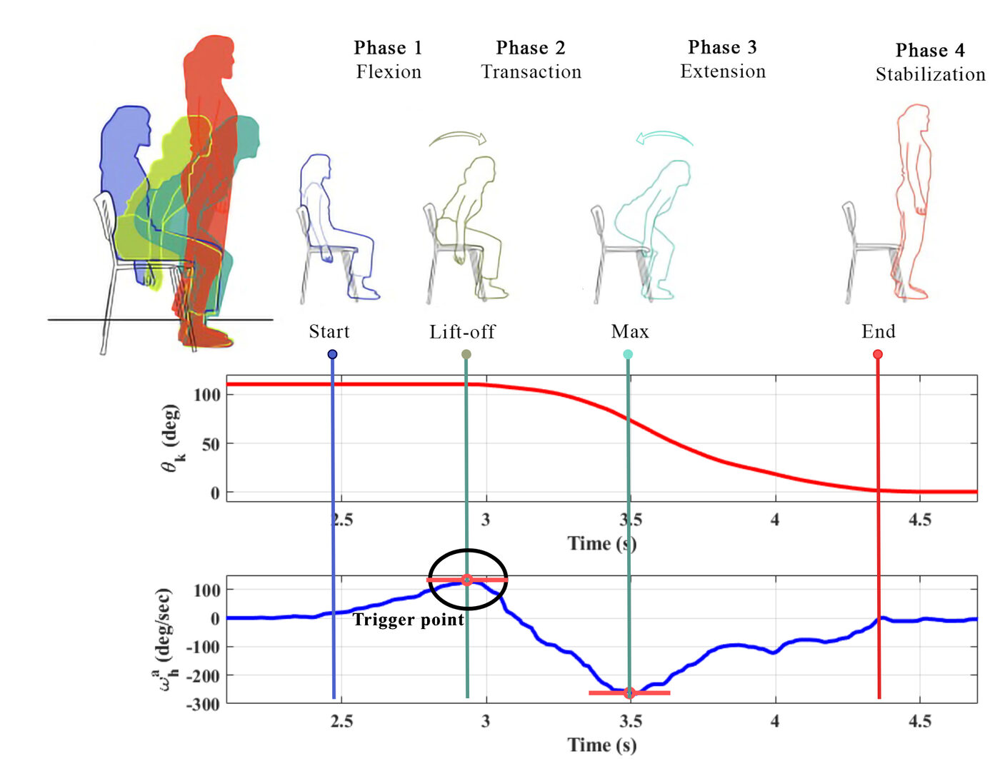
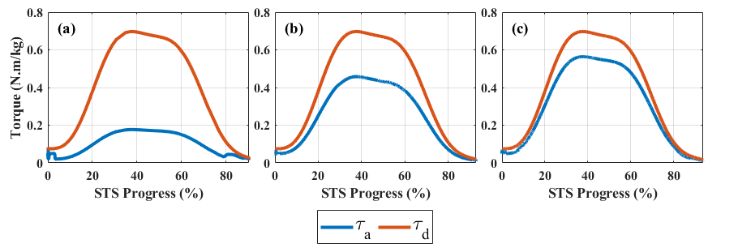
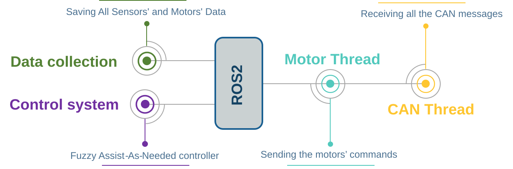
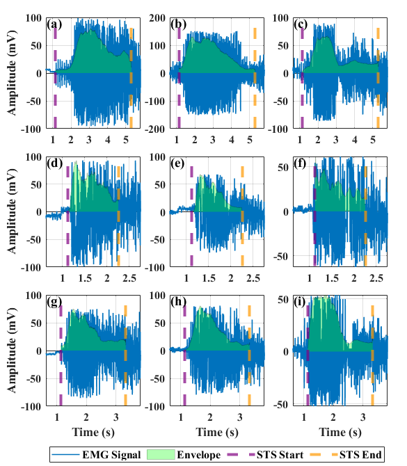

<div class="case-summary">

A fuzzy "Strength Index" adapts knee-exoskeleton torque in real time while the user stands up from a chair. In a four-person engineering study it cut measured muscle effort by 30% at slow speed, with smaller gains at faster speeds.

This is a research prototype from FUM CARE. I am first author of a [preprint on SSRN](https://doi.org/10.2139/ssrn.6335794), which has not been peer-reviewed. The study was an engineering evaluation and was not clinical.

</div>

<dl class="snapshot">
  <div><dt>My role</dt><dd>Project manager and first author, in a university research team</dd></div>
  <div><dt>Device</dt><dd>FUM-NEXA: passive hip and actuated knee joint per leg</dd></div>
  <div><dt>Task</dt><dd>Standing up from a 46 cm chair</dd></div>
  <div><dt>Runtime</dt><dd>Raspberry Pi 4B, ROS2 (Python/C++), CAN motor control</dd></div>
  <div><dt>Evaluation</dt><dd>4 healthy subjects × 3 speeds × 3 device conditions</dd></div>
</dl>

## The problem {#the-problem}

Fixed torque profiles are simple to deploy, but they can't tell a user who is moving faster than the reference from one who needs substantial help. A rehabilitation device also has to avoid the opposite failure: giving so much torque that the user stops contributing.

The project had to meet several constraints at once:

- estimate how much help is needed from signals available on the robot, without continuous EMG control;
- adapt torque *during* the movement as well as between sessions;
- run on a Raspberry Pi-class computer with a small sensor and actuator set;
- start assisting at the right moment, close to lifting off the chair;
- show that the device reduces effort **after** accounting for its own weight and inertia.

The last constraint turned out to matter most. Wearing the exoskeleton with the motors off *increased* measured muscle effort by about 40%, so the controller had to more than offset the device's own burden before it could help.

## My role

I was project manager and first author. It was a team project at FUM CARE, and I was not the sole designer, fabricator or experimenter.

I developed the control concept, meaning the Strength Index, the fuzzy rule base and the torque-scaling policy. I connected the controller to ROS2, the CAN sensors and actuators, real-time filtering and logging. I coordinated the control, mechanical, experimental and writing work needed to get from concept to a working prototype, and helped structure the three device conditions and three speeds used for validation. I also wrote the manuscript and prepared its figures.

## Main design decisions

The controller estimates how much help the user needs from hip and knee velocity errors and torque feedback, without EMG. That estimate of the user's capability is indirect, but it needs no extra sensors on the body.

It scales a reference torque using the index: assistive torque = desired torque × (1 − Strength Index). The movement target stays the same while the amount of help changes.

We chose a small rule base. Nine fuzzy rules run comfortably on a Raspberry Pi and are easy to inspect and tune, which suited a small team and limited compute better than a learned model.

Assistance starts at chair lift-off. The right torque at the wrong phase of the movement is still a bad experience, so we treated the trigger point as a requirement.

The evaluation included a motors-off condition, which separated the device's burden from the controller's benefit.



*The four sit-to-stand phases, with the trigger point near chair lift-off.*

## Results {#results}

Average change in muscle effort (EMG IRMS) across the four subjects, relative to standing up without the exoskeleton. Positive values mean less effort.

| Condition | Speed | Effort change | Variability change |
| --- | --- | ---: | ---: |
| Assistance on (50% setting) | Slow | 30.34% less | 33.81% less |
| Assistance on (50% setting) | Normal | 13.20% less | 16.45% less |
| Assistance on (50% setting) | Fast | 7.59% less | 14.10% less |
| Motors off | Slow | 41.21% more | 30.09% more |
| Motors off | Normal | 38.70% more | 36.17% more |
| Motors off | Fast | 40.87% more | 42.53% more |

Assistance reduced measured effort at all three speeds. The benefit was largest at slow speed, where help matters most for users who struggle to follow the reference, and it shrank at fast speed, so the controller was not equally effective everywhere. The device's own burden was large enough that the results could only be interpreted against the motors-off condition.

<div class="callout">

Four healthy subjects are not a clinical cohort. These results show engineering feasibility and say nothing yet about rehabilitation efficacy. The study did not report latency, confidence intervals, statistical significance, actuator safety margins or long-term reliability. The next step would need more and more varied participants, comfort and safety measures, and repeatability data.

</div>



*The adaptive torque keeps the shape of the reference profile at a lower magnitude across the three speeds.*

## What I took into product work

A feature can make things worse before it helps, so I now try to measure the cost of adopting a product separately from the value of using it.

Timing belongs in the requirements. Correct output delivered at the wrong moment still fails the user.

Limited compute and sensing pushed this design toward a small controller that is easy to explain, and that worked in its favour.

## Technical detail

<details>
<summary>How the Strength Index works</summary>

The controller represents the user's instantaneous capability as a value between 0 and 1. It takes three inputs: knee angular-velocity error, hip angular-velocity error, and the difference between desired and delivered assistive torque. Each input maps to Negative, Zero or Positive fuzzy sets, and the output uses five bands. A nine-rule Mamdani system combines them, using the minimum for rule firing and centroid defuzzification.

When the user keeps up with the reference, the index rises and assistance falls. When the user lags, or the robot isn't delivering the expected torque, the index falls and assistance rises.

The desired hip and knee velocity profiles are sixth-degree polynomials fitted to 20 normal sit-to-stand motions from able-bodied data. A normalized knee torque-angle profile provides the full-assistance reference, which the index scales.

</details>

<details>
<summary>Runtime architecture</summary>

```text
CAN sensor data
  → filter joint velocity and torque
  → compute motion and torque errors
  → fuzzy Strength Index → scale desired torque
  → motor-driver PID → CAN → knee BLDC actuators
  → log sensor, motor and controller data
```

The controller is written in Python, with C++ ROS2 nodes for CAN reading and motor commands (SocketCAN). Real-time second-order Butterworth filters, configured for a 400 Hz sampling assumption, use a 5 Hz cutoff for hip velocity and 10 Hz for knee velocity and torque feedback.



</details>

<details>
<summary>Experimental protocol</summary>

Four healthy subjects stood up from a 46 cm chair at three target speeds (slow 20°/s, normal 35°/s, fast 60°/s) under three conditions: no exoskeleton, exoskeleton with motors off, and exoskeleton with assistance at the 50% setting. EMG was recorded from the vastus lateralis, semimembranosus and hamstrings. The analysis used IRMS as a measure of overall muscle effort, signal standard deviation for variability, and percentage change from the no-exoskeleton baseline.



</details>

<details>
<summary>Hardware and software stack</summary>

- Two T-Motor BLDC knee actuators (rated up to 48 Nm) with magnetic joint encoders
- Raspberry Pi 4B running ROS2
- Python, C++, NumPy, SciPy and scikit-fuzzy
- CAN bus for sensor acquisition and motor commands
- Fuzzy assistance controller on top, PID torque control on the motor driver

</details>

## Publication

S. M. Sarfarazi, S. Farhadi, H. Sabzali, M. H. Gheshlaghi, I. Kardan and A. Akbarzadeh, "A Fuzzy Strength Index for Adaptive Assist-as-Needed Control of a Knee Exoskeleton Robot to Enhance Sit-to-Stand Transition," SSRN preprint, posted March 2026. [doi:10.2139/ssrn.6335794](https://doi.org/10.2139/ssrn.6335794). The preprint has not been peer-reviewed. Code and video are not public.
