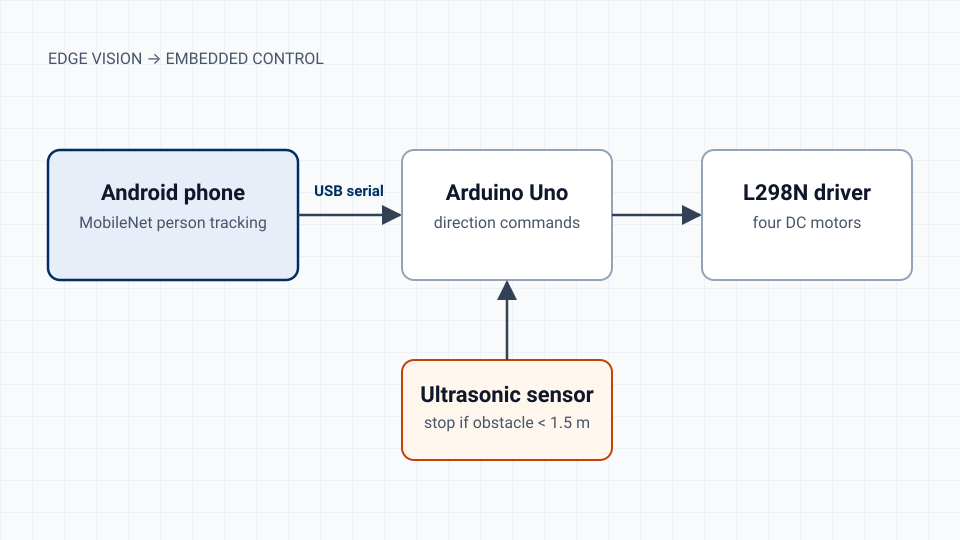

A course project in which I owned the requirements and the end-to-end build of a small robot that follows a person indoors.

## What I built

A Python (Kivy/Buildozer) Android app runs a TensorFlow Lite MobileNet v1 model on the phone to detect and select the person to follow, at roughly 60 frames per second.

The phone sends forward, backward, left, right and stop commands over USB serial to an Arduino Uno, which drives four DC motors through an L298N driver.

An HC-SR04 ultrasonic sensor overrides the vision system. It stops or redirects the robot whenever an obstacle is closer than 1.5 m.

## Decisions worth noting

I compared a Raspberry Pi with a smartphone as the compute platform, and SAMURAI, YOLOv8 and MobileNet as detectors, choosing on inference efficiency. Running vision on the phone kept the robot's electronics simple and cheap.

## Limits

This was a course prototype. It was not evaluated with a formal protocol, and no code or video is public.
