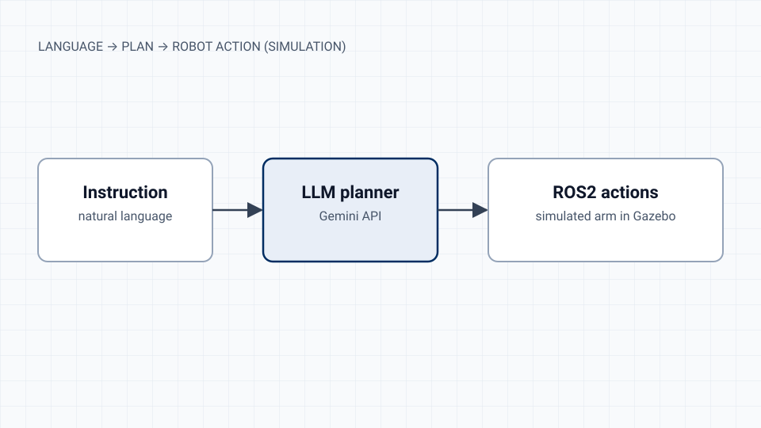

This is a personal experiment in connecting a language model to a robot safely. The model proposes a plan, and ROS2 executes it on a simulated arm.

## What it does

It takes an instruction in plain language and uses the Gemini API to turn it into a sequence of ROS2 actions, which then run on a simulated robotic arm in Gazebo.

## Status and limits

This is an early-stage experiment. It has no formal evaluation yet, and the code is not public. I'll update this page with a repository, the supported task set and results when there is something worth measuring.

The same question drives [ViGenX](/projects/vigenx-agentic-video-editor/): how to let a language model plan while keeping execution verifiable.
