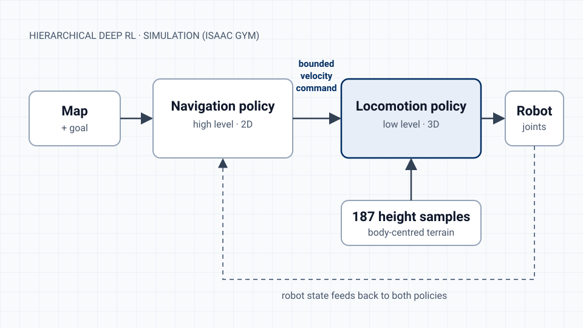

Separating *where to go* from *how to walk* let a simulated quadruped reach 94.2% navigation success, including 88.6% on map layouts it had never seen.

This is simulation research, presented as a conference paper at ICRoM 2025. A public proceedings record is not available yet. My M.Sc. thesis extends this work and is still in progress, and this page reports no hardware results.

## The problem

A legged robot crossing cluttered, uneven ground has two jobs at once: choose a route around obstacles, and place its feet so it doesn't fall. Training one "monolithic" policy to do both mixes very different objectives, and it tends to generalize poorly to new layouts.

## The approach

A high-level navigation policy works on a 2D map and goal, and outputs a body-frame velocity command. That command is bounded, so the navigation policy can't ask for motion the locomotion policy can't deliver.

A low-level locomotion policy tracks the command in 3D. It uses 187 terrain height samples around the robot's body and does no explicit footstep planning.

Both policies were trained and evaluated in GPU-parallel Isaac Gym simulation. In the reported setup, training took about five hours on a single GPU.

## My role

I was second author on a three-person paper. I designed the hierarchical structure and implemented the reinforcement-learning path-planning component. In the lab, I also define requirements, evaluation criteria and success metrics for this line of experiments.

## Results (simulation) {#results}

| Measure, from the paper's simulation evaluation | Result |
| --- | ---: |
| Overall navigation success | 94.2% |
| Success on unseen map layouts, without retraining | 88.6% |
| End-to-end success with combined obstacles and terrain | 87.4% |
| Collisions compared with the monolithic baseline | 71.4% fewer |

These numbers come from simulation under the paper's evaluation protocol, and none of them were measured on a physical robot.

## How this carries over to product work

Deciding what the upper layer may request, and what the lower layer guarantees, turned one hard problem into two testable ones, and each layer could be evaluated against its own success criteria. I use the same approach when I scope product features and split work between teams.

## Thesis work, in progress

The thesis extends the architecture toward risk-aware navigation. It combines global graph search (Dijkstra) with sampling-based local planning (MPPI) and a distributional reinforcement-learning controller for locomotion. Results will be published once the thesis is complete.

## Citation

Y. Ayoubi Rad, S. M. Sarfarazi and M. Shahbazi, "Hierarchical Deep Reinforcement Learning for Quadruped Navigation over Complex Terrains," *13th RSI International Conference on Robotics and Mechatronics (ICRoM 2025)*, Tehran, December 2025. A public link will be added when the proceedings record is available.
