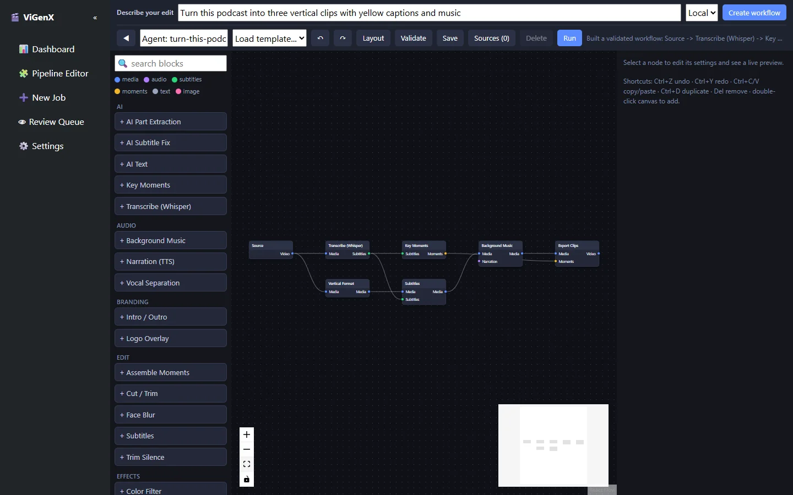

ViGenX turns a plain-language editing brief into a typed, validated workflow. A person can inspect and change that workflow, and nothing renders until they approve it.

It is my own open-source project. I built the initial MVP in 2025 and showed it at Diginext's 10th Startup Camp. The current release is pre-1.0, suitable for development and testing, and has not yet been validated with external users.

<dl class="snapshot">
  
<dt>My role</dt><dd>Independent product and technical lead</dd>

  
<dt>Stage</dt><dd>Pre-1.0, locally run, Apache-2.0</dd>

  
<dt>Built with</dt><dd>Python, Flask, React Flow, Whisper and FFmpeg, with optional Gemini, Groq or NVIDIA planning</dd>

  
<dt>Links</dt><dd><a href="https://github.com/mahdisf/vigenx">Repository</a> · <a href="https://mahdisf.ir/vigenx/">Landing page</a></dd>

</dl>

<figure>

<figcaption>The brief becomes a graph of registered blocks that can be edited before it runs.</figcaption>
</figure>

## The problem

Turning a long recording into short clips means repeating the same steps. You transcribe it, find the moments worth keeping, reframe for vertical video, add captions and music, and export. One-prompt generative tools promise to automate this, but they tend to return a finished render. You can't see which decisions were made or change one step without starting again, and rerunning the same edit gives a different result.

That matters more when the footage carries obligations, such as licensed music, people's faces or third-party clips, because an opaque result is hard to review. My working hypothesis was that creators would trust automation more if they could read and change the plan before it touched their footage.

## My role

ViGenX is my own project. I defined the product vision, requirements, MVP scope and roadmap, and I led the technical build. Diginext hosted the startup camp where I showed the first MVP. It was not my employer and does not own the project.

## What I know about users so far

There has been no structured external user research yet. The problem definition comes from my earlier work producing and editing video content, and from building the first MVP.

That MVP shipped three fixed pipelines: general, speaker and gaming. The current version replaces them with composable blocks that a planner assembles for each brief, so a new kind of edit needs a new block instead of a new pipeline. The fixed pipelines stay available until the graph version reaches parity.

## Main product decisions {#key-product-decisions}

### The model plans and a person approves

I considered letting a language model drive the edit end to end. That is the fastest route to a demo, but it is opaque and hard to repeat. Instead, the planner compiles a brief into a graph built only from registered blocks. It cannot invent block types, parameters, file paths, commands or upload targets, and it marks every workflow it generates as requiring approval. The cost is that the planner can only do what the block catalog supports, so new capabilities need engineering work.

### Users edit the workflow directly

The graph is serializable JSON. It opens in a visual editor and can be saved and rerun, so users spend their time reviewing, adjusting and reusing an edit instead of regenerating it from another prompt.

### Planning works without an API key

A deterministic local planner handles common requests such as clip count, duration, vertical format, captions, music and branding. Model-backed planning is optional. In *Auto* mode ViGenX falls back to the local planner when no key is set, and in *AI* mode it fails with an error if no provider is configured. The local planner understands a narrower range of briefs.

### Every export carries rights information

Each export writes a rights manifest and metadata. Publishing adapters act only on approved jobs and default to private visibility where the platform supports it. The documentation says plainly that automation does not establish fair use or ownership.

### What I left out

ViGenX is not a hosted service, has no multi-user authentication (it binds to localhost) and is not meant to edit autonomously. Leaving these out kept the scope achievable for one person and kept the trust boundary simple.

## Delivery

I built the initial MVP in 2025 in five-week Agile sprints. It was a Python and Flask pipeline that turned long-form video into short clips, with transcription, key-moment scoring and face blurring using Whisper, MediaPipe, YOLOv8 and Gemini. It also had live job monitoring, a review queue, and metadata and rights files.

The open-source version, public since June 2026, adds a React Flow editor with generated inspector controls, templates and undo/redo. It has a block catalog for editing, audio, branding, AI analysis and export, per-node progress, batch sources, publisher adapters that wait for approval, and an entry point for third-party blocks.

## Evidence and results {#results}

What exists today:

- a public, Apache-2.0 repository with continuous integration and unit, API, planner, concurrency and persistence tests;
- a working prompt-to-workflow path that runs without downloading models or setting an API key;
- the showing of the initial MVP at Diginext's 10th Startup Camp.

There is no external usage data, structured user feedback or measured time saving yet. The test suite does not prove render quality on arbitrary footage, and the documentation says so. I am not claiming adoption or product-market fit.

## What I learned, and what's next

Separating planning from execution is what makes this AI feature reviewable. I apply the same pattern to AI in engineering software, where a wrong action is expensive and users need to check what the system intends to do before it acts.

Writing down the non-goals and the rights disclaimer early made later scope decisions faster.

The next validation step is to get the first external users to run ViGenX on footage they are allowed to edit and report exactly where it fails. On the engineering side, the open priorities are prompt-to-workflow evaluations with small licensed test videos, bounded render verification, node caching, and workflow diffs with dry-run cost estimates.

## Artifacts

- [Source code and documentation](https://github.com/mahdisf/vigenx)
- [Landing page](https://mahdisf.ir/vigenx/)
- [Contribution guide](https://github.com/mahdisf/vigenx/blob/master/CONTRIBUTING.md)
